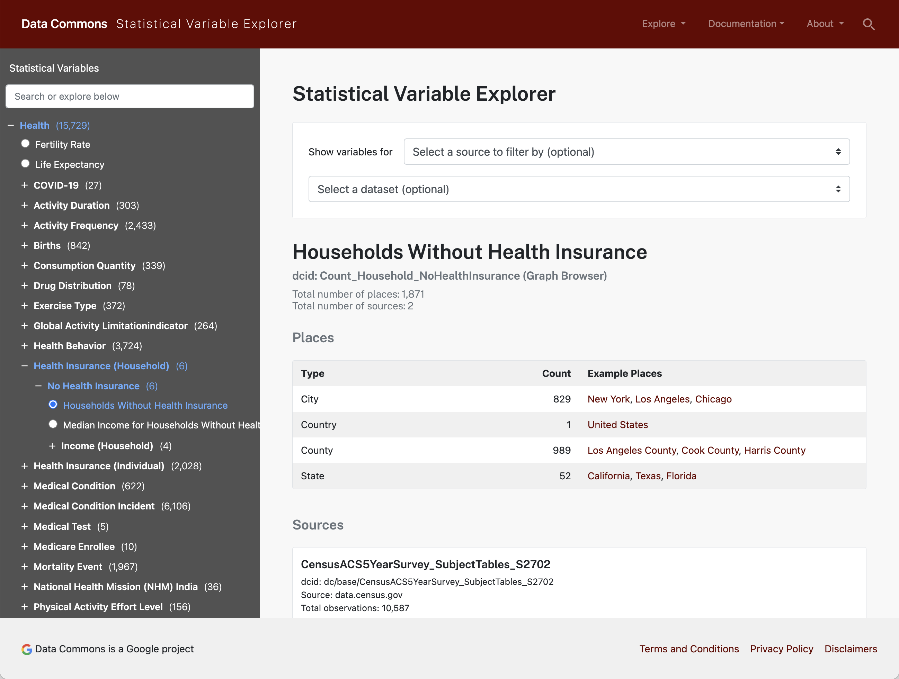

# datacommons-js

Embed [Data Commons](https://datacommons.org) [statistical variable](https://datacommons.org/tools/statvar) observation visualizations in your web application.

## Usage

Include datacommons.js and styles in your html `<head>...</head>` tag

```
<link rel="stylesheet" href="https://datacommons.org/css/ranking.min.css" />
<link rel="stylesheet" href="https://datacommons.org/css/nl_interface.min.css" />
<script src="https://datacommons.org/datacommons.js"></script>
```

For testing on autopush, replace the above script tag with

```html
<script src="https://autopush.datacommons.org/datacommons.js"></script>
```

## Examples

- Basic web component examples: [example.html](./example.html)
- Dynamic web component example: [example-dynamic.html](./example-dynamic.html)
- JS examples: [example-js.html](./example-js.html)

### Data Commons Statistical Variables

Find datasets using the [Data Commons Statistical Variable Explorer](https://datacommons.org/tools/statvar).

Example: Inspecting [Health / Health Insurance (Household) / No Health Insurance / Households Without Health Insurance](https://datacommons.org/tools/statvar#sv=Count_Household_NoHealthInsurance) shows us that the statistical variable `Count_Household_NoHealthInsurance` is available in the `United States` (Data Commons ID, or DCID: `country/USA`) at `State`, `County`, and `City` levels.



Use the [Data Commons Graph Browser](https://datacommons.org/browser) to understand the relationship between entities. For example, the [country/USA](https://datacommons.org/browser/country/USA) page shows us the DCIDs for all US states and territories.

### Web Component Map

Draw a choropleth map by adding the `datacommons-map` element to your HTML

### Example: Households with no health insurance in US States

```html
<datacommons-map
  title="Households with no health insurance in US States"
  placeDcid="country/USA"
  enclosedPlaceType="State"
  statVarDcid="Count_Household_NoHealthInsurance"
></datacommons-map>
```

Renders: 

### Example: Households with no health insurance in Texas counties

```html
<datacommons-map
  title="Households with no health insurance in Texas counties"
  placeDcid="geoId/48"
  enclosedPlaceType="County"
  statVarDcid="Count_Household_NoHealthInsurance"
></datacommons-map>
```

Renders: 

### Example: Population below the poverty level in US States

```html
<datacommons-map
  title="Population below the poverty level in US States"
  placeDcid="country/USA"
  enclosedPlaceType="State"
  statVarDcid="Count_Person_BelowPovertyLevelInThePast12Months"
></datacommons-map>
```

Renders: 

### JS Bar chart Draw

a multi-variable bar chart

Initialize empty div

```html
<div id="bar-example"></div>
```

Render the chart

```js
datacommons.drawBar(document.getElementById("bar-example"), {
  id: "bar-chart-1",
  svgChartHeight: 200,
  className: "my-chart",
  apiRoot: datacommons.root,
  title:
    "Population Below Poverty Level Status in Past Year in States of United States",
  place: {
    dcid: "country/USA",
    name: "United States of America",
    types: ["Country"],
  },
  enclosedPlaceType: "State",
  statVarSpec: [
    {
      name: "Population Below Poverty Level Status in Past Year",
      statVar: "Count_Person_BelowPovertyLevelInThePast12Months",
    },
  ],
});
```

Renders:


### JS Line chart

Draw a multi-variable line chart

Initialize empty div

```html
<div id="line-example"></div>
```

Render the chart

```js
datacommons.drawLine(document.getElementById("line-example"), {
  id: "line-chart-1",
  svgChartHeight: 200,
  className: "my-chart",
  apiRoot: datacommons.root,
  title: "Population Below Poverty Level Status in Past Year in United States",
  place: {
    dcid: "country/USA",
    name: "United States of America",
    types: ["Country"],
  },
  statVarSpec: [
    {
      name: "Population Below Poverty Level Status in Past Year",
      statVar: "Count_Person_BelowPovertyLevelInThePast12Months",
    },
  ],
});
```

Renders:


### JS Map chart

Draw a choropleth map

Initialize empty div

```html
<div id="map-example"></div>
```

Render the chart

```js
datacommons.drawMap(document.getElementById("map-example"), {
  id: "map-chart-1",
  svgChartHeight: 200,
  className: "my-chart",
  apiRoot: datacommons.root,
  title:
    "Population Below Poverty Level Status in Past Year in States of United States",
  place: {
    dcid: "country/USA",
    name: "United States of America",
    types: ["Country"],
  },
  enclosedPlaceType: "State",
  statVarSpec: {
    name: "Population Below Poverty Level Status in Past Year",
    statVar: "Count_Person_BelowPovertyLevelInThePast12Months",
  },
});
```

Renders:


### Ranking chart

Draw ranking chart (bar chart + ordered table)

Initialize empty div

```html
<div id="ranking-example"></div>
```

Render the chart

```js
datacommons.drawRanking(document.getElementById("ranking-example"), {
  placeName: "USA",
  placeType: "State",
  withinPlace: "country/USA",
  statVar: "Count_Person_BelowPovertyLevelInThePast12Months",
  isPerCapita: false,
  scaling: 1,
  unit: "",
  date: "2020",
});
```

Renders:


## API

### `datacommons.drawBar`

Draws bar chart tile with specified [statistical variable](https://datacommons.org/tools/statvar).

- `element` (HTMLElement)

  DOM element to attach the chart

- `props` (BarTilePropType)

  Chart configuration object

  - `id` (string)

    DOM id attribute to attach to the chart

  - `title` (string)

    Chart title

  - `place` (NamedTypedPlace)

    Scope the statistical variable query by this place configuration

    - `dcid` (string): Place DCID
    - `name` (string): Place name
    - `types` (string[]): [Place types](https://datacommons.org/browser/Place)

  - `enclosedPlaceType` (string)

    Show statistical variable observations at this place type. Must be enclosed in the parent place type.

  - `comparisonPlaces` (string[])

    A list of related places dcids to show comparison with the main place.

  - `statVarSpec` (StatVarSpec)

    Datacommons [statistical variable](https://datacommons.org/tools/statvar) configuration

    - `statVar` (string): Statistical variable dcid
    - `denom` (string): Denominator (e.g., `Count_Person`)
    - `unit` (string): [Unit](https://datacommons.org/browser/UnitOfMeasure) (e.g., '$')
    - `scaling` (number):
    - `log` (boolean): Set to true to color values using logarithmic scale
    - `name?` (string):

  - `svgChartHeight` (number)

    Height (px) for the underlying SVG chart.

  - `className` (string)

    Extra classes to add to the container.

  - `apiRoot?` (string)

    Datacommons API root. Default: `https://datacommons.org`

### `datacommons.drawLine`

Draws line chart tile with specified [statistical variable](https://datacommons.org/tools/statvar).

- `element` (HTMLElement)

  DOM element to attach the chart

- `props` (LineTilePropType)

  Chart configuration object

  - `id` (string)

    DOM id attribute to attach to the chart

  - `title` (string)

    Chart title

  - `place` (NamedTypedPlace)

    Scope the statistical variable query by this place configuration

    - `dcid` (string): Place DCID
    - `name` (string): Place name
    - `types` (string[]): [Place types](https://datacommons.org/browser/Place)

  - `comparisonPlaces` (string[])

    A list of related places dcids to show comparison with the main place.

  - `statVarSpec` (StatVarSpec)

    Datacommons [statistical variable](https://datacommons.org/tools/statvar) configuration

    - `statVar` (string): Statistical variable dcid
    - `denom` (string): Denominator (e.g., `Total_Population`)
    - `unit` (string): [Unit](https://datacommons.org/browser/UnitOfMeasure) (e.g., '$')
    - `scaling` (number):
    - `log` (boolean): Set to true to color values using logarithmic scale
    - `name?` (string):

  - `svgChartHeight` (number)

    Height (px) for the underlying SVG chart.

  - `className` (string)

    Extra classes to add to the container.

  - `apiRoot?` (string)

    Datacommons API root. Default: `https://datacommons.org`

### `datacommons.drawMap`

Draws choropleth map with specified statistical variables.

- `element` (HTMLElement)

  DOM element to attach the chart

- `props` (MapTilePropType)

  Chart configuration object

  - `id` (string)

    DOM id attribute to attach to the chart

  - `title` (string)

    Chart title

  - `place` (NamedTypedPlace)

    Scope the statistical variable query by this place configuration

    - `dcid` (string): Place DCID
    - `name` (string): Place name
    - `types` (string[]): [Place types](https://datacommons.org/browser/Place)

  - `enclosedPlaceType` (string)

    Show statistical variable observations at this place type. Must be enclosed in the parent place type.

  - `statVarSpec` (StatVarSpec)

    Datacommons [statistical variable](https://datacommons.org/tools/statvar) configuration

    - `statVar` (string): Statistical variable dcid
    - `denom` (string): Denominator (e.g., `Total_Population`)
    - `unit` (string): [Unit](https://datacommons.org/browser/UnitOfMeasure) (e.g., '$')
    - `scaling` (number):
    - `log` (boolean): Set to true to color values using logarithmic scale
    - `name?` (string):

  - `svgChartHeight` (number)

    Height (px) for the underlying SVG chart.

  - `className` (string)

    Extra classes to add to the container.

  - `apiRoot?` (string)

    Datacommons API root. Default: `https://datacommons.org`

### `datacommons.drawRanking`

Draw ranking chart (bar chart + ordered table)

- `element` (HTMLElement)

  DOM element to attach the chart

- `props` (RankingPagePropType)

  Chart configuration object

  - `placeName` (string)
  - `placeType` (string)
  - `withinPlace` (string)
  - `statVar` (string)
  - `isPerCapita` (boolean)
  - `scaling` (number)
  - `unit` (string)
  - `date` (string)
