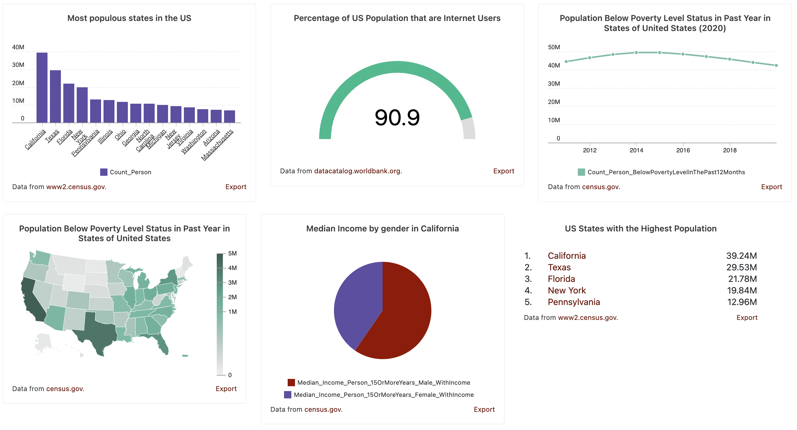
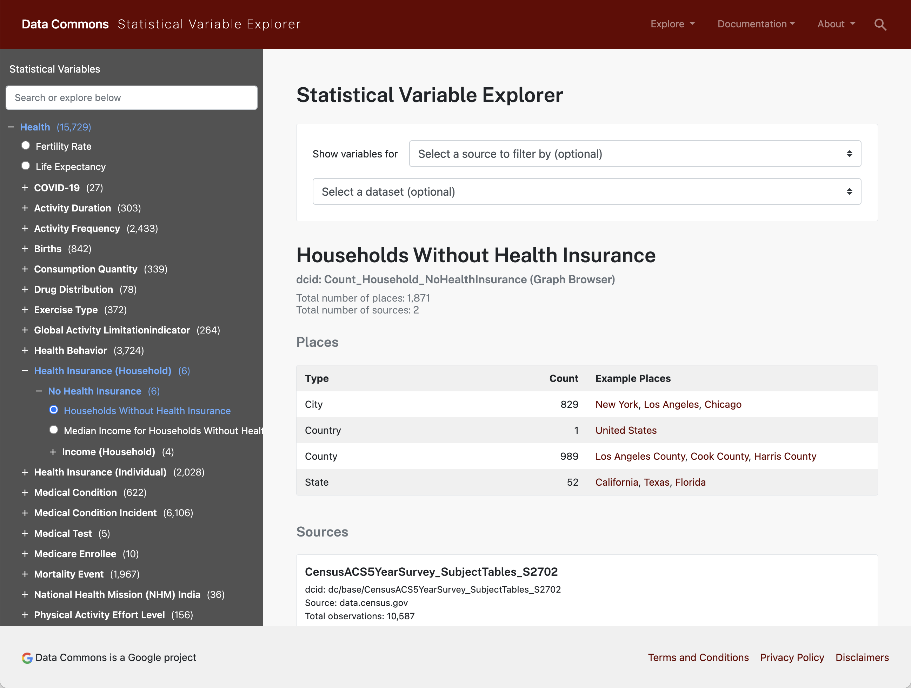

# Data Commons Web Components

Embed [Data Commons](https://datacommons.org)
[statistical variable](https://datacommons.org/tools/statvar) observation
visualizations in your web application.



## Usage

Include `datacommons.js` and `datacommons.min.css` in your html's `<head>...</head>` tag. Then use `datacommons-*` [web component](https://developer.mozilla.org/en-US/docs/Web/API/Web_components) tags to add embedded data visualizations.

Example:

```html
<html>
  <head>
    <link
      rel="stylesheet"
      href="https://datacommons.org/css/datacommons.min.css"
    />
    <script src="https://datacommons.org/datacommons.js"></script>
  </head>
  <body>
    <datacommons-line
      title="US Population Over Time"
      place="country/USA"
      variables="Count_Person"
    ></datacommons-line>
  </body>
</html>
```

[Playground](https://lit.dev/playground/#gist=c0c88276739f4f6061807cc943937a14) ([source](./examples/line-chart.html))

## Components

- [datacommons-bar](./docs/components/bar.md)
- [datacommons-gauge](./docs/components/gauge.md)
- [datacommons-line](./docs/components/line.md)
- [datacommons-map](./docs/components/map.md)
- [datacommons-pie](./docs/components/pie.md)
- [datacommons-ranking](./docs/components/ranking.md)
- [datacommons-slider](./docs/components/slider.md)

## Examples

- [Static page with all chart types playground](https://lit.dev/playground/#gist=822ce6018bb41113c866d703760c1def) ([source](./examples/all-charts.html)):
- [Dynamically updating charts playground](https://lit.dev/playground/#gist=9e3ac88e162248f849dd276ff5895ad0) ([source](./examples/dynamic-map.html))

## Variables and places

Data Commons web components visualize statistical variables about one or more places.
Variables and places are identified by [Data Commons Identifiers](https://docs.datacommons.org/glossary.html#dcid), or DCIDs.

To find the DCID of a place or variable:

1. Browse all 175K+ variables with the [Data Commons Statistical Variable Explorer](https://datacommons.org/tools/statvar).

2. Search for places and variables with the [Data Commons Search](https://datacommons.org/search) page.

3. Use the [Data Commons Graph Browser](https://datacommons.org/browser) to
   understand the relationship between entities.

> Example #1: Inspecting [Health / Health Insurance (Household) / No Health Insurance / Households Without Health Insurance](https://datacommons.org/tools/statvar#sv=Count_Household_NoHealthInsurance) shows us that the statistical variable `Count_Household_NoHealthInsurance` is available in the `United States` (DCID: `country/USA`) at `State`, `County`, and `City` levels.



> Example #2 , the graph browser [country/USA](https://datacommons.org/browser/country/USA) page shows the DCIDs for all US states and territories.

## Styling

Custom styles are supported through [CSS shadow parts](https://developer.mozilla.org/en-US/docs/Web/CSS/::part).

| CSS `::part`                          | Description                                                                                                 | Components                 |
| ------------------------------------- | ----------------------------------------------------------------------------------------------------------- | -------------------------- |
| `container`                           | Chart container element                                                                                     | All                        |
| `legend`                              | Chart legend                                                                                                | `bar`, `line`, `map`,`pie` |
| `place-path`                          | Geo boundary                                                                                                | `map`                      |
| `place-path-<dcid>`                   | Geo boundary for a particular place. Example: `place-path-geoId\/12` \*                                     | `map`                      |
| `series`                              | Series data (line, bar, lollipop, etc)                                                                      | `bar`, `line`. `pie`       |
| `series-place-<dcid>`                 | Series data for a particular place. Example: `series-place-geoId\/12` \*                                    | `bar`, `line`. `pie`       |
| `series-place-<dcid>-variable-<dcid>` | Series data for a particular place and variable. Example: `series-place-geoId\/12-variable-Count_Person` \* | `bar`, `line`              |
| `series-variable-<dcid>`              | Series data for a variable. Example: `series-place-variable-Count_Person`                                   | `bar`, `line`. `pie`       |
| `title`                               | Chart title                                                                                                 | All                        |
| `x-axis`                              | X-axis line                                                                                                 | `bar`, `line`              |
| `x-axis-text`                         | X-axis label text                                                                                           | `bar`, `line`              |
| `x-axis-tick`                         | X-axis tick mark                                                                                            | `bar`, `line`              |
| `y-axis-text`                         | Y-Axis label text                                                                                           | `bar`, `line`              |
| `y-axis-tick`                         | Y-Axis tick mark                                                                                            | `bar`, `line`              |

_\* Escape forward slashes in `::part()` names_

Example:

```html
<html>
  <head>
    <style>
      #styled-map::part(container) {
        border-radius: 10px;
        border: 1px solid #f5f5f5;
        box-shadow: 1px 2px 6px rgba(3, 7, 18, 0.04),
          5px 8px 25px rgba(3, 7, 18, 0.08);
      }
      #styled-map::part(legend) {
        border: 1px solid #e1e1e1;
        padding: 5px 8px;
        border-radius: 10px;
      }
      #styled-map::part(title) {
        font-weight: 200;
        font-size: 16px;
        margin-bottom: 16px;
        color: #111a1b;
      }
      #styled-map::part(place-path) {
        fill: #e9e9e9;
      }
      #styled-map::part(place-path-geoId\/12),
      #styled-map::part(place-path-geoId\/13),
      #styled-map::part(place-path-geoId\/06) {
        fill-opacity: 1;
        fill: #e76f51;
        stroke: #b72a53;
        stroke-width: 2px;
      }
    </style>
  </head>
  <body>
    <datacommons-map
      id="styled-map"
      title="Three most populous US states"
      parentPlace="country/USA"
      childPlaceType="State"
      variable="Count_Person"
    ></datacommons-map>
  </body>
</head>
```

[Playground](https://lit.dev/playground/#gist=719f5d71c2823ac3e58f504cb6ceccd3) ([source](./examples/map-styles.html))

## License

[Apache 2.0](./LICENSE)

## Support

For general questions or issues, please open an issue on our
[issues](https://github.com/datacommonsorg/website/issues) page. For all other
questions, please send an email to `support@datacommons.org`.
