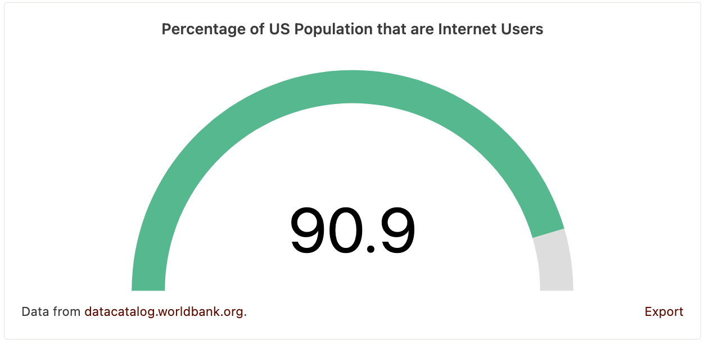

# Data Commons Gauge Chart Web Component

[Data Commons Web Component](../../README.md) for visualizing a single statistical variable about a single place.

## Usage

```html
<datacommons-gauge
  title="Percentage of US Population that are Internet Users"
  place="country/USA"
  variable="Count_Person_IsInternetUser_PerCapita"
  min="0"
  max="100"
></datacommons-gauge>
```



### Attributes

Required:

- `max` _number_

  Gauge maximum value.

- `min` _number_

  Gauge minimum value.

- `place` _string_

  Place DCID to plot.

- `title` _string_

  Chart title.

- `variable` _string_

  Variable DCID to plot.

Optional:

- `colors` _string_

  Optionally specify a custom chart color for the display variable.

  Value should follow CSS specification (keywords, rgb, rgba, hsl, #hex). Example `"#ff0000"`. Make sure color has no spaces. For example, use `rgba(255,0,0,0.3)` instead of `rgba(255, 0, 0, 0.3)`.
