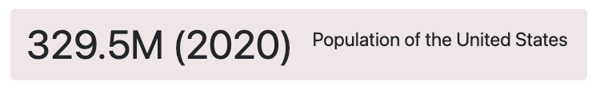

# Data Commons Highlight Chart Web Component

[Data Commons Web Component](../../README.md) for highlighting a specific
variable value from a specific variable about a single place.

## Usage

```html
<datacommons-highlight
  title="Percentage of US Population that are Internet Users"
  place="country/USA"
  variable="Count_Person_IsInternetUser_PerCapita"
  min="0"
  max="100"
></datacommons-highlight>
```



### Attributes

Required:

- `header` _string_

  Text to show next to the variable value highlighted.

- `place` _string_

  Place DCID to plot.

- `variable` _string_

  Variable DCID to plot.

Optional:

- `date` _string_

  Specific date to show data for. ISO 8601 format (e.g. "YYYY", "YYYY-MM", "YYYY-MM-DD").

  Note: Ensure your variable has data available at the specified date using the [Stat Var Explorer](https://datacommons.org/tools/statvar)

  Default: Most recent data available.

- `unit` _string_
  
  Unit the variable is measured in.
