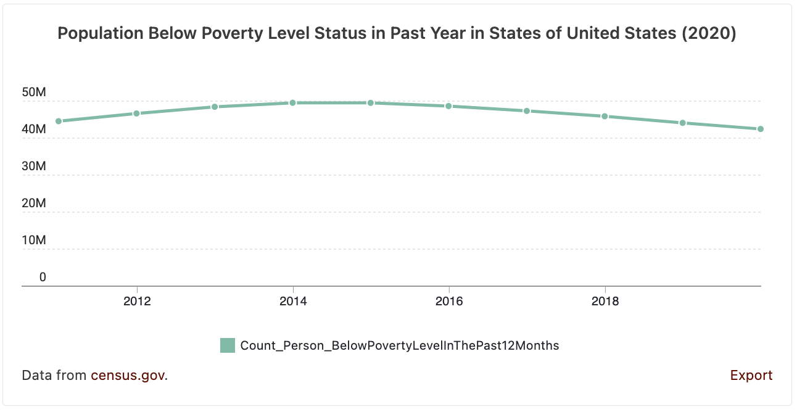

# Data Commons Line Chart Web Component

[Data Commons Web Component](../../README.md) for visualizing one or more statistical variables about a single place.

## Usage

```html
<datacommons-line
  title="Population Below Poverty Level Status in Past Year in States of United States (2020)"
  place="country/USA"
  variables="Count_Person_BelowPovertyLevelInThePast12Months"
></datacommons-line>
```



### Attributes

Required:

- `header` _string_

  Chart title.

- `place` _string_

  Place DCID to plot.

- `variables` _space-separated list of strings_

  Variable DCID(s) to plot. Example: `"Count_Person Count_Farm"`.

Optional:

- `colors` _space-separated list of strings_

  Optionally specify a custom chart color for each variable. Pass colors in the same order as variables.

  Values should follow CSS specification (keywords, rgb, rgba, hsl, #hex). Separate multiple values with spaces, e.g., `"#ff0000 #00ff00 #0000ff"`. Make sure individual colors have no spaces. For example, use `rgba(255,0,0,0.3)` instead of `rgba(255, 0, 0, 0.3)`.

- `variableNameRegex` _string_

  Optionally specify regex to use to extract out variable name. e.g., if the variableNameRegex is "(.*?)(?=:)", only the part before a ":" will be used for variable names. So "variable 1: test" will become "variable 1".

- `defaultVariableName` _string_

  To be used with variableNameRegex. If specified and no variable name is extracted out with the regex, use this as the variable name. e.g., if the variableNameRegex is "(.*?)(?=:)", and the defaultVariableName is "Total", for a variable named "variable 1", it will become "Total".

- `timeScale` _string_

  One of `"year"`, `"month"`, or `"day"`. If provided, the x-axis will draw a tick mark and label at that time scale.

- `placeNameProp` _string_

  Optionally specify the property to use to get the place names.

- `startDate` _string_

  Optionally specify the latest date to show on the line chart in ISO-8601

- `endDate` _string_

  Optionally specify the latest date to show on the line chart in ISO-8601
