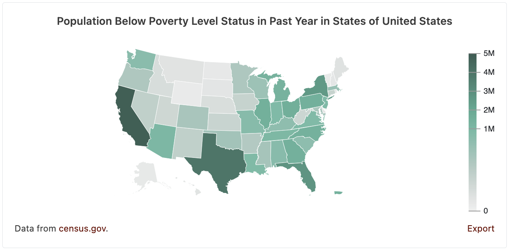

# Data Commons Map Web Component

[Data Commons Web Component](../../README.md) for visualizing a single statistical variables around one or more places on a map.

## Usage

```html
<datacommons-map
  title="Population Below Poverty Level Status in Past Year in States of United States"
  parentPlace="country/USA"
  childPlaceType="State"
  variable="Count_Person_BelowPovertyLevelInThePast12Months"
></datacommons-map>
```



### Attributes

Required:

- `childPlaceType` _string_

  Child place types to plot. Example: `State`.

- `header` _string_

  Chart title.

- `parentPlace` _string_

  Parent place DCID to plot. Example: `country/USA`.

- `variable` _string_

  Variable DCID to plot. Example: `"Count_Person"`.

Optional:

- `colors` _list of strings_

  List up to three colors to define a custom color scale.

  Values should follow CSS specification (keywords, rgb, rgba, hsl, #hex). Separate multiple values with spaces, e.g., `"#ff0000 #00ff00 #0000ff"`. Make sure individual colors have no spaces. For example, use `rgba(255,0,0,0.3)` instead of `rgba(255, 0, 0, 0.3)`.

  - If one color is given: a luminance based color scale will be used
  - If two colors are given: a divergent color scale will be used, with the first color corresponding to the min value, and the second color corresponding to the max value.
  - If three colors are given: a color scale with the first three colors corresponding to [min, mean, max] values will be used.

- `date` _string_

  Specific date to show data for. ISO 8601 format (e.g. "YYYY", "YYYY-MM", "YYYY-MM-DD").

  Note: Ensure your variable has data available at the specified date using the [Stat Var Explorer](https://datacommons.org/tools/statvar)

  Default: Most recent data available.

- `subscribe` _string_

  Listen for data changes on this event channel. Channel name should match the `publish` name on a control component. Example: [datacommons-slider](./slider.md)

### Examples

A map of population below poverty level in US States in the year 2020:

```html
<datacommons-map
  title="Population Below Poverty Level Status in Past Year in States of United States (2020)"
  parentPlace="country/USA"
  childPlaceType="State"
  variable="Count_Person_BelowPovertyLevelInThePast12Months"
  date="2020"
></datacommons-map>
```
