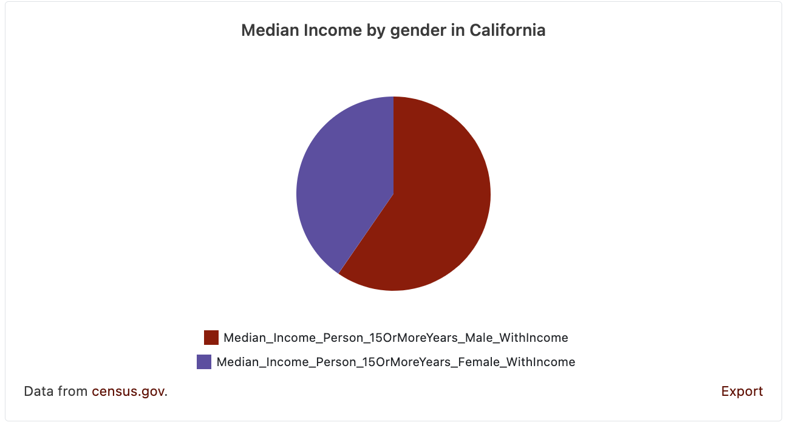

# Data Commons Pie/Donut Chart Web Component

[Data Commons Web Component](../../README.md) for visualizing multiple statistical variables around a single place on a pie/donut chart.

## Usage

```html
<datacommons-pie
  title="Median Income by gender in California"
  place="geoId/06"
  variables="Median_Income_Person_15OrMoreYears_Male_WithIncome Median_Income_Person_15OrMoreYears_Female_WithIncome"
></datacommons-pie>
```



### Attributes

Required:

- `header` _string_

  Chart title.

- `place` _string_

  Place to plot. Example: `country/USA`.

- `variables` _list of strings_

  Variables to plot. Example: `Median_Income_Person_15OrMoreYears_Male_WithIncome Median_Income_Person_15OrMoreYears_Female_WithIncome`

Optional:

- `colors` _space-separated list of strings_

  Optionally specify a custom chart color for each variable. Pass colors in the same order as variables.

  Values should follow CSS specification (keywords, rgb, rgba, hsl, #hex). Separate multiple values with spaces, e.g., `"#ff0000 #00ff00 #0000ff"`. Make sure individual colors have no spaces. For example, use `rgba(255,0,0,0.3)` instead of `rgba(255, 0, 0, 0.3)`.

- `donut` _boolean_

  Include to draw as a donut chart instead of a pie chart.

### Examples

A donut chart of median income by gender in California

```html
<datacommons-pie
  title="Median Income by gender in California"
  place="geoId/06"
  variables="Median_Income_Person_15OrMoreYears_Male_WithIncome Median_Income_Person_15OrMoreYears_Female_WithIncome"
  colors="#8367C7 #C2F8CB"
  donut
></datacommons-pie>
```
