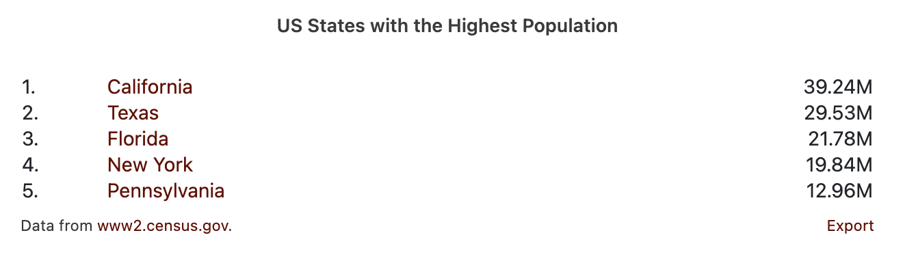

# Data Commons Ranking Chart Web Component

[Data Commons Web Component](../../README.md) for listing statistical variables around a single place in descending or ascending order.

## Usage

```html
<datacommons-ranking
  title="US States with the Highest Population"
  parentPlace="country/USA"
  childPlaceType="State"
  variable="Count_Person"
></datacommons-ranking>
```



### Attributes

Required:

- `childPlaceType` _string_

  Child place types to plot. Example: `State`.

- `header` _string_

  Chart title.

- `parentPlace` _string_

  Parent place DCID to plot. Example: `country/USA`.

- `variable` _string_

  Variable DCID to plot. Example: `Count_Person`

Optional:

- `hideFooter` _boolean_
  
  Whether to hide the footer with download link.

  Default: false

- `highestTitle` _string_
  
  Chart title to show if `header` is not provided. Will only show if a
  highest-to-lowest ranking is shown.

- `lowestTitle` _string_

  Chart title to show if `header` is not provided. Will only show if a
  lowest-to-highest ranking is shown.

- `perCapita` _list of strings_

  A list of variable DCIDs to rank by per capita value. Entries in the list should be separated by spaces. Example: `"dcid1 dcid2"`.

- `rankingCount` _integer_
  
  How many places to show, e.g. the "N" in "Top-N".

  Default: 5.

- `showExploreMore` _boolean_

  Whether to show "Explore more" link, which takes the user to Datacommons.org's visualization tools.

- `showHighestLowest` _boolean_

  Whether to show both the top and bottom places, ordered highest-to-lowest, in one chart.

  Default: false.

- `showLowest` _boolean_

  Include to sort values in ascending order. Ignored if `showHighestLowest` is true.

  Default sort order: descending.

- `showMultiColumn` _boolean_

  Whether to show variables across multiple columns in one table, with a header for each variable. The last variable provided is used for ranking.

  Default: false. If multiple variables are provided, a separate ranking table is generated for each variable.

- `variables` _list of strings_

  A list of variable DCIDs to plot. Entries in the list should be separated by spaces. Example: `"dcid1 dcid2"`.

### Examples

Show a ranking of US States by population, lowest to highest

```html
<datacommons-ranking
  title="US States with the Lowest Population"
  parentPlace="country/USA"
  childPlaceType="State"
  variable="Count_Person"
  showLowest
></datacommons-ranking>
```
