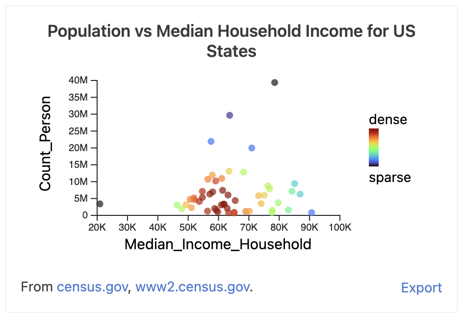

# Data Commons Scatter Chart Web Component

[Data Commons Web Component](../../README.md) for visualizing the relationship
between two variables.

## Usage

```html
<datacommons-scatter
  title="Population vs Median Household Income for US States"
  parentPlace="country/USA"
  childPlaceType="State"
  variables="Count_Person Median_Income_Household"
></datacommons-scatter>
```



### Attributes

Required:

- `header` _string_

  Chart title.

- `place` _string_

  Place DCID to plot.

- `variables` _space-separated list of strings_

  Variable DCID(s) to plot. Example: `"Count_Person Count_Farm"`. At least 2
  variables must be provided, and only the first 2 variables will be plotted.

Optional:

- `highlightBottomLeft` _boolean_

  Whether to label outliers in the bottom left quadrant. Defaults to false.

- `highlightBottomRight` _boolean_

  Whether to label outliers in the bottom right quadrant. Defaults to false.

- `highlightTopLeft` _boolean_

  Whether to label outliers in the top left quadrant. Defaults to false.

- `highlightTopRight` _boolean_
  
  Whether to label outliers in the top right quadrant. Defaults to false.
  
- `showPlaceLabels` _boolean_

  Whether to label all points with the place they correspond to.
  Defaults to false.

- `showQuadrants` _boolean_

  Whether to show grid lines delimiting top right, top left, bottom right, and
  bottom left quadrants. Defaults to false.
