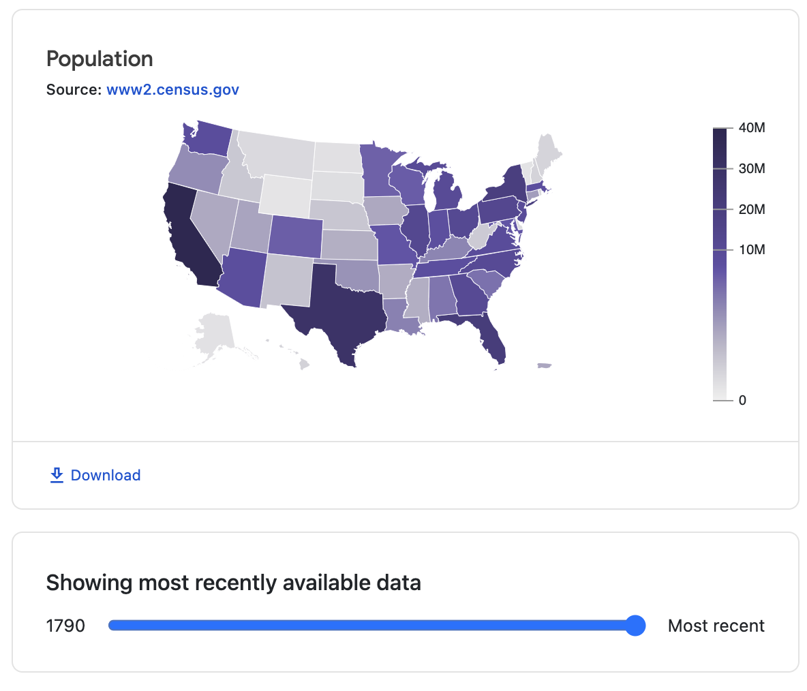

# Data Commons Slider Web Component

[Data Commons Web Component](../../README.md) for controlling the date in [datacommons-map](./map.md).

## Usage

```html
<!-- Listen for date changes on the "dc-year" channel -->
<datacommons-map
  title="Population"
  parentPlace="country/USA"
  childPlaceType="State"
  subscribe="dc-map"
  variable="Count_Person"
></datacommons-map>

<!-- Publish date changes on the "dc-year" channel  -->
<datacommons-slider
  max="2023"
  min="1950"
  publish="dc-year"
  value="2023"
></datacommons-slider>
```



### Attributes

Required:

- `max` _number_

  Maximum slider value.

- `min` _number_

  Minimum slider value

- `publish` _string_

  Event name to publish on slider change

- `value` _number_

  Initial slider value
