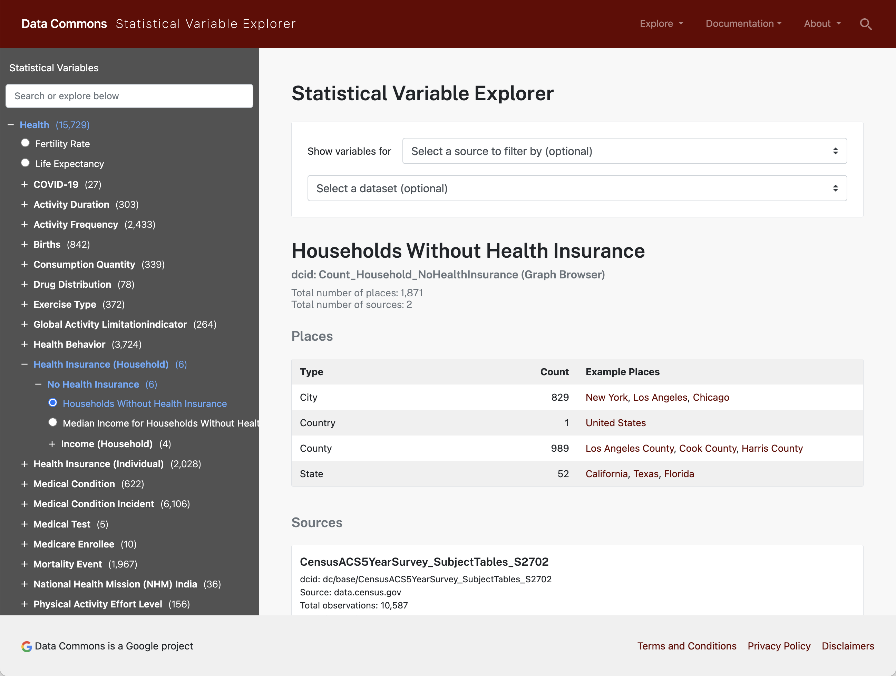
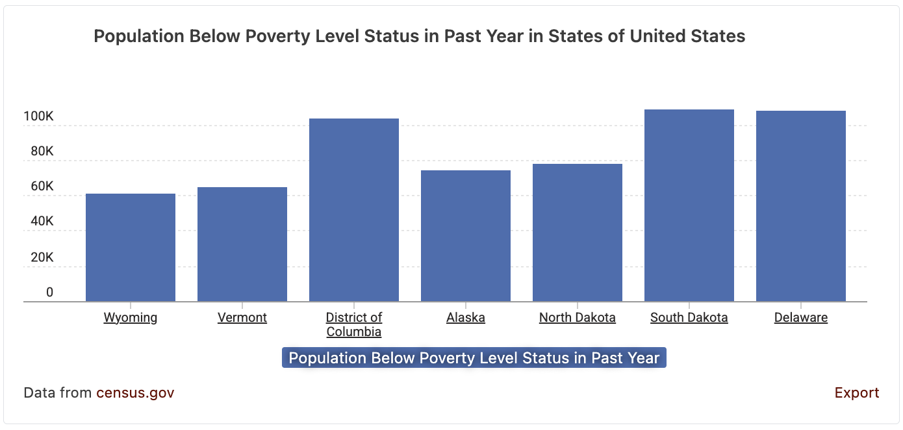
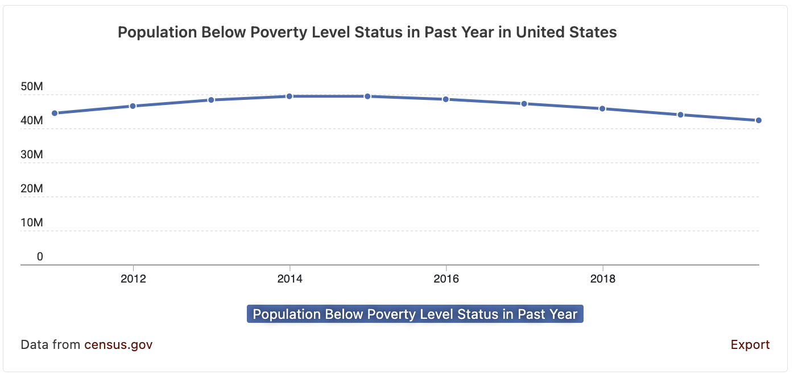
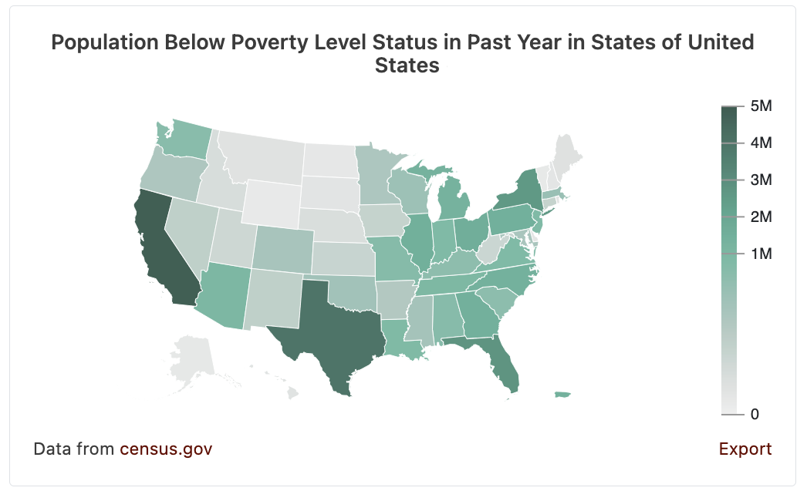
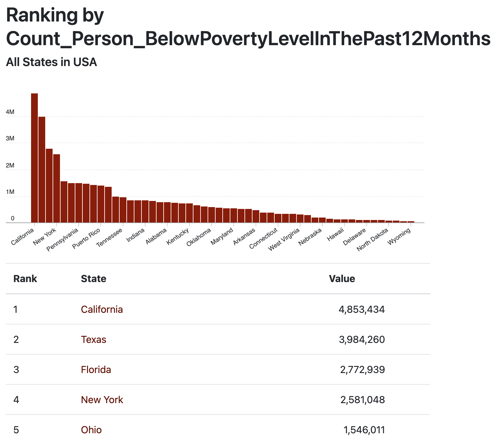

# Data Commons JS Web Components

Embed [Data Commons](https://datacommons.org) [statistical variable](https://datacommons.org/tools/statvar) observation visualizations in your web application.

## Usage

Include datacommons.js and styles in your html `<head>...</head>` tag

```html
<link rel="stylesheet" href="https://datacommons.org/css/ranking.min.css" />
<link rel="stylesheet" href="https://datacommons.org/css/nl_interface.min.css" />
<script src="https://datacommons.org/datacommons.js"></script>
```

Then add the web components desired. A minimal example would be:
```html
<html>
  <head>
    <link rel="stylesheet" href="https://datacommons.org/css/ranking.min.css" />
    <link rel="stylesheet" href="https://datacommons.org/css/nl_interface.min.css" />
    <script src="https://datacommons.org/datacommons.js"></script>
  </head>
  <body>
    <!-- Embed a line chart -->
    <datacommons-line
      title="US Population Over Time"
      place="country/USA"
      variables='["Count_Person"]'
    ></datacommons-line>
  </body>
</html>
```
For a full list of supported charts and attributes, see our
[Web Component Documentation](./docs/README.md).

### Finding DCIDs for Places and Variables

Find data using the [Data Commons Statistical Variable Explorer](https://datacommons.org/tools/statvar).

Example: Inspecting [Health / Health Insurance (Household) / No Health Insurance / Households Without Health Insurance](https://datacommons.org/tools/statvar#sv=Count_Household_NoHealthInsurance) shows us that the statistical variable `Count_Household_NoHealthInsurance` is available in the `United States` (Data Commons ID, or DCID: `country/USA`) at `State`, `County`, and `City` levels.



Use the [Data Commons Graph Browser](https://datacommons.org/browser) to understand the relationship between entities. For example, the [country/USA](https://datacommons.org/browser/country/USA) page shows us the DCIDs for all US states and territories.

## Examples

Basic webpage with examples of each kind of supported chart:
[example.html](./examples/example.html)

Example of adding some custom javascript to enable dynamic updating of charts:
[example-dynamic.html](./examples/example-dynamic.html)

## Supported Chart Types

### Bar Chart



### Line Chart



### Map Chart



### Ranking Chart


