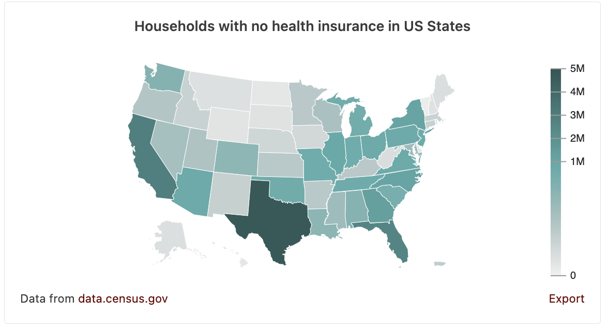
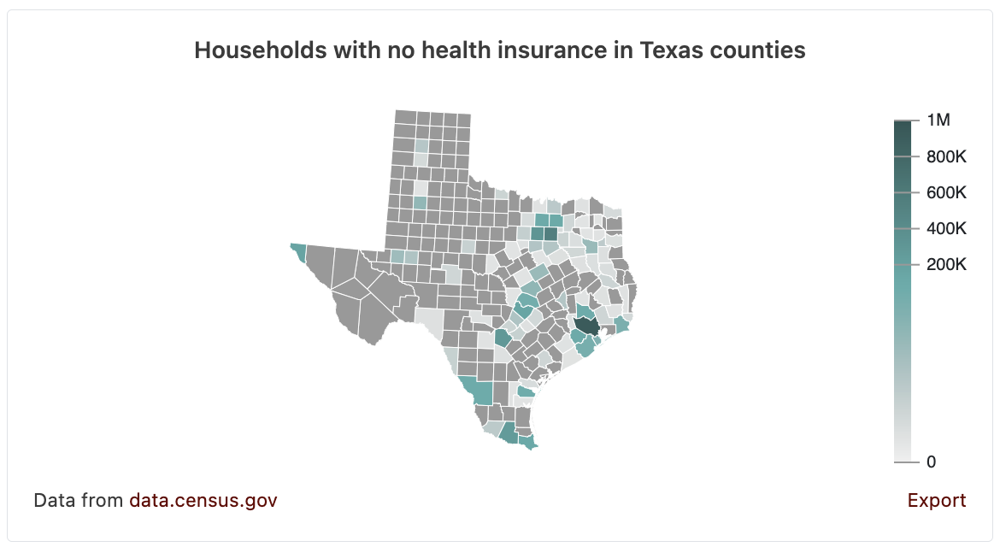
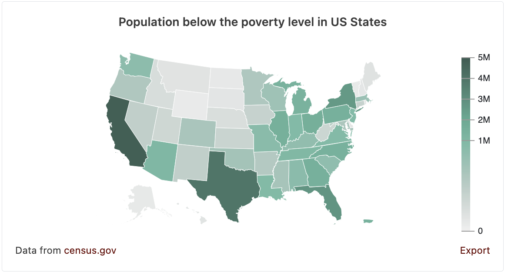

# Chart Component APIs

## Including the library

Embed [Data Commons](https://datacommons.org) charts in your web pages including
datacommons.js and styles in your webpage's `<head></head>` tags. These files
must be included for the web components to work.

```html
<link rel="stylesheet" href="https://datacommons.org/css/ranking.min.css" />
<link rel="stylesheet" href="https://datacommons.org/css/nl_interface.min.css" />
<script src="https://datacommons.org/datacommons.js"></script>
```

### Example

```html
<html>
  <head>
    <link rel="stylesheet" href="https://datacommons.org/css/ranking.min.css" />
    <link rel="stylesheet" href="https://datacommons.org/css/nl_interface.min.css" />
    <script src="https://datacommons.org/datacommons.js"></script>
  </head>
  <body>
    <!-- Embedded charts will go here -->
  </body>
</html>
```

Each web component is a custom HTML element that takes a number of attributes.

## Bar Chart

Element Syntax:
```html
<datacommons-bar></datacommons-bar>
```

### Attributes

Required:

- `childPlaceType` string
  - Type of child places to plot.
- `place` string
  - Type of child places to plot.
- `title` string
  - Title of the chart.
- `variable` string
  - DCID of the variable to plot

Optional:

- `barHeight` number
  - Bar height for horizontal charts, in px.
- `comparisonPlaces` string
  - List of DCIDs of specific places to plot.
  - If provided, `place` and `childPlaceType` will be ignored.
- `comparisonVariables` string
  - List of DCIDs of multiple variables to plot.
  - If provided, `variable` will be ignored.
- `maxPlaces` number
  - Maximum number of child places to plot
- `sort` string
  - Bar chart sort order
  - Options:
    - `ascending` (ascending by the variable's value)
    - `descending` (descending by the variable's value)
    - `ascendingPopulation` (ascending by the place's population)
    - `descendingPopulation` (descending by the place's population)
  - Default: `descendingPopulation`

### Examples

#### 1.

Example here.

## Line Chart

Element Syntax:
```html
<datacommons-line></datacommons-line>
```

### Attributes

Required:

- `place` string
  - Type of child places to plot.
- `title` string
  - Title of the chart.
- `variables` string
  - List of DCIDs of the variables to plot

### Examples

#### 1. US population over time

```html
<datacommons-line
  title="US Population Over Time"
  place="country/USA"
  variables='["Count_Person"]'
></datacommons-line>
```

## Map Chart

Element Syntax:
```html
<datacommons-map></datacommons-map>
```

### Attributes

Required:

- `childPlaceType` string
  - Type of child places to plot.
- `date` string
  - Specific date to show data for.
  - Date should be formmated in ISO 8601 (e.g. "YYYY", "YYYY-MM", "YYYY-MM-DD")
    and match the format used by the variable being plotted.
- `place` string
  - Type of child places to plot.
- `title` string
  - Title of the chart.
- `variable` string
  - DCID of the variable to plot

Optional:

- `subscribe` string
  - Event channel to subscribe to.
  - The event channel must match the event channel of the slider component
    controlling the map.

### Examples

#### 1. Households with no health insurance in US States

```html
<datacommons-map
  title="Households with no health insurance in US States"
  place="country/USA"
  childPlaceType="State"
  variable="Count_Household_NoHealthInsurance"
></datacommons-map>
```

Renders:


#### 2. Households with no health insurance in Texas counties

```html
<datacommons-map
  title="Households with no health insurance in Texas counties"
  place="geoId/48"
  enclosedPlaceType="County"
  variable="Count_Household_NoHealthInsurance"
></datacommons-map>
```

Renders:



#### 3. Population below the poverty level in US States

```html
<datacommons-map
  title="Population below the poverty level in US States"
  place="country/USA"
  childPlaceType="State"
  variable="Count_Person_BelowPovertyLevelInThePast12Months"
></datacommons-map>
```

Renders:


## Ranking Chart

Element Syntax:
```html
<datacommons-ranking></datacommons-ranking>
```

### Attributes

Required:

- `childPlaceType` string
  - Type of child places to plot.
- `date` string
  - Specific date to show data for.
  - Date should be formmated in ISO 8601 (e.g. "YYYY", "YYYY-MM", "YYYY-MM-DD")
    and match the format used by the variable being plotted.
- `place` string
  - Type of child places to plot.
- `title` string
  - Title of the chart.
- `variable` string
  - DCID of the variable to plot

Optional:

- `showLowest` boolean
  - Whether to show a lowest-to-highest ranking.
  - To show places with lowest value first, set to true.
  - If not provided, defaults to highest-to-lowest by variable value.

### Examples

#### 1.

Example here.